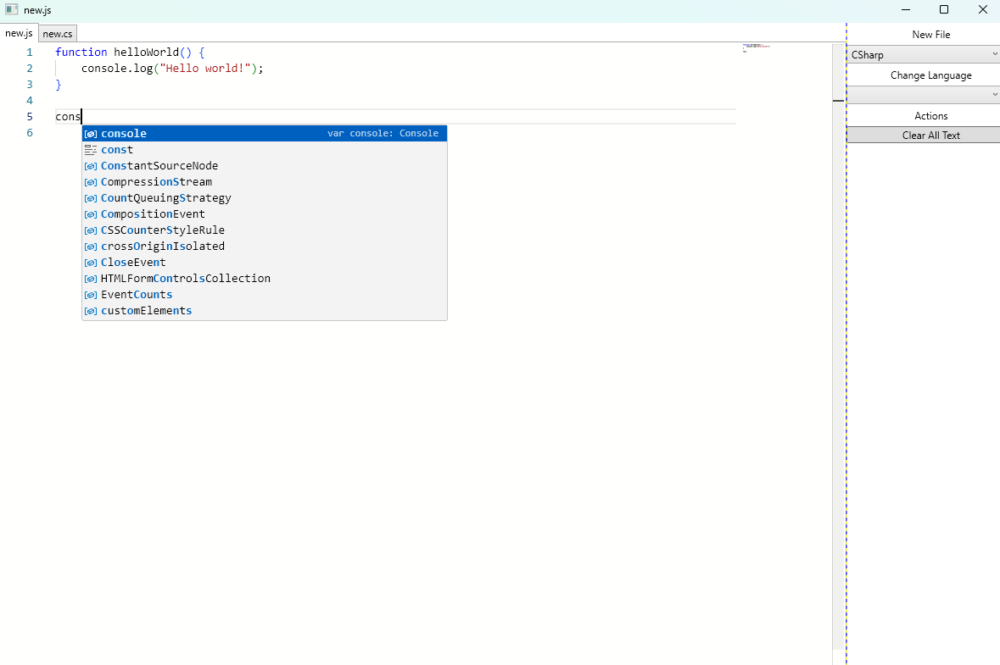

# Code Reviewer

## Author(s)

- [Justin Stevens](https://github.com/JSteve0/)

## Project Description

Currently, a work in progress text editor that will have built-in AI features.

### Current Features
- Create, view, and edit JavaScript and CSharp files.
- Uses the [Monaco Editor](https://microsoft.github.io/monaco-editor/) as the code editor which comes with the following 
  - Basic Syntax Colorization
  - IntelliSense and Code Validation

## Project Images:

