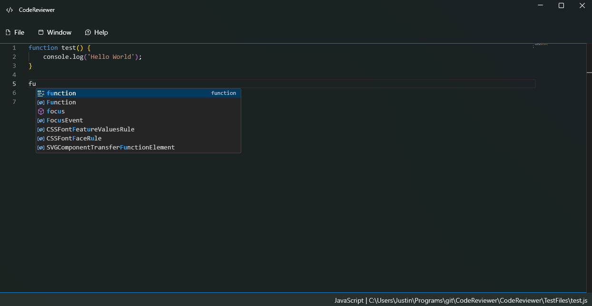

# Code Reviewer

## Author(s)

- [Justin Stevens](https://github.com/JSteve0/)

## Project Description

Code Reviewer is a text editor currently in development that integrates advanced AI features for enhanced coding assistance. The application aims to support multiple programming languages file creation, editing, and validation.

### Current Features

- **File Management**: Create, view, and edit JavaScript and C# files.
- **Editor**: Utilizes the [Monaco Editor](https://microsoft.github.io/monaco-editor/) with:
  - Basic syntax colorization
  - IntelliSense and code validation

### Future Features

- AI-powered code review and suggestions
- Enhanced file management capabilities
- Support for additional programming languages

### Project Images



### Installation
- Follow the guide in the latest release

### Installation

1. **Clone the repository**:
    ```bash
    git clone https://github.com/JSteve0/CodeReviewer.git
    ```
2. **Download and install the code editor**:
    1. Download [Monaco-Editor Version 0.5](https://registry.npmjs.org/monaco-editor/-/monaco-editor-0.50.0.tgz) Zip from this link.
   2. Extract the contents 
   3. Move the `package/min` folder in `CodeReviewer/MonacoEditor`
3. **Run the application**:
  - Use an IDE like Visual Studio or JetBrains Rider to run the project.
  - I'll list alternative ways to run the application here in the future.

### Usage

- **Create a New File**: Click on the "New File" button and select the desired language.
- **Change Language**: Use the language selection buttons to switch between JavaScript and C#.

### Contributing

If you would like to contribute to the project, please fork the repository and submit a pull request with your changes.

### License

This project is licensed under the [MIT License](LICENSE).
